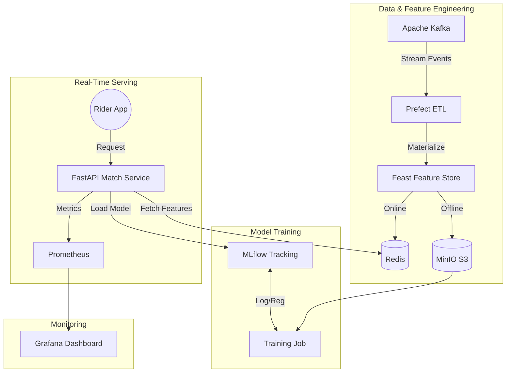

# 🚖 RideMatch: Real-Time Driver Matching System

[](https://www.python.org/)
[](https://fastapi.tiangolo.com/)
[](https://feast.dev/)
[](https://mlflow.org/)
[](https://www.prefect.io/)
[](https://kafka.apache.org/)
[](https://www.docker.com/)

> **A production-grade, real-time machine learning system** for matching riders with drivers. Built with modern MLOps principles, this project demonstrates an end-to-end pipeline from data ingestion to real-time inference and monitoring.

---

## 🏗️ System Architecture

RideMatch connects multiple components to deliver low-latency match predictions:



## 🚀 Key Features

*   **Real-Time Inference**: FastAPI service responding in <10ms (p95) using cached online features.
*   **Feature Store**: **Feast** backed by **Redis** (Online) and **MinIO** (Offline) to prevent training-serving skew.
*   **Model Registry**: **MLflow** for robust version control, experiment tracking, and model staging.
*   **Orchestration**: **Prefect** workflows for reliable ETL pipelines and scheduled re-training.
*   **Observability**: Full stack monitoring with **Prometheus** (metrics scraping) and **Grafana** (dashboards for latency, data quality, and error rates).
*   **Reproducibility**: Dockerized environment for consistent deployment.

---

## 🛠️ Tech Stack

| Component | Technology | Role |
| :--- | :--- | :--- |
| **Serving** | FastAPI, Uvicorn | High-performance REST API for inference |
| **Feature Store** | Feast, Redis, MinIO | Serving real-time and historical features |
| **ML Ops** | MLflow | Model tracking, registry, and artifact storage |
| **Orchestration** | Prefect | Workflow management (ETL, Training) |
| **Streaming** | Apache Kafka | Ingestion of driver availability events |
| **Monitoring** | Prometheus, Grafana | System health, latency, and data drift tracking |
| **Infrastructure** | Docker Compose | Container orchestration |

---

## ⚡ Quick Start

### Prerequisites
*   Docker & Docker Compose
*   Python 3.9+
*   Git

### 1. Clone & Setup
```bash
git clone https://github.com/bhanujjj/Ridematch.git
cd Ridematch

# Create virtual env
python -m venv .mlflow-venv
source .mlflow-venv/bin/activate
pip install -r requirements.txt
```

### 2. Start Infrastructure
Spin up Kafka, Redis, MinIO, MLflow, Prometheus, and Grafana:
```bash
cd infra
docker-compose up -d
```

### 3. Initialize Feature Store & Materialize Data
```bash
cd feature_repo
feast apply
python materialize_features.py
```

### 4. Train & Register Model
```bash
cd ../src/models
python train_ranking_model.py
```

### 5. Run the Match API
```bash
cd ../../
python -m uvicorn src.match_api.main:app --host 0.0.0.0 --port 8000
```

---

## 📊 Monitoring

The system comes with a pre-configured monitoring stack.

1.  **Prometheus**: Scrapes API metrics from `http://localhost:8000/metrics`.
2.  **Grafana**: Visualizes system health.
    *   **URL**: `http://localhost:3000` (User/Pass: `admin`/`admin`)
    *   **Dashboard**: Import `infra/grafana_dashboard.json` to see:
        *   Request Latency (p50/p95)
        *   Error Rates
        *   Prediction Score Distributions
        *   Missing Feature Rates

---

## 📂 Project Structure

```text
├── src/
│   ├── match_api/       # FastAPI application & Request schemas
│   └── models/          # Model training & Logic
├── feature_repo/        # Feast configuration & definitions
├── infra/               # Docker Compose & Monitoring configs
├── prefect/             # ETL & Workflow definitions
├── tests/               # Integration tests
└── requirements.txt     # Python dependencies
```

---

## 📜 License

Distributed under the MIT License. See `LICENSE` for more information.
