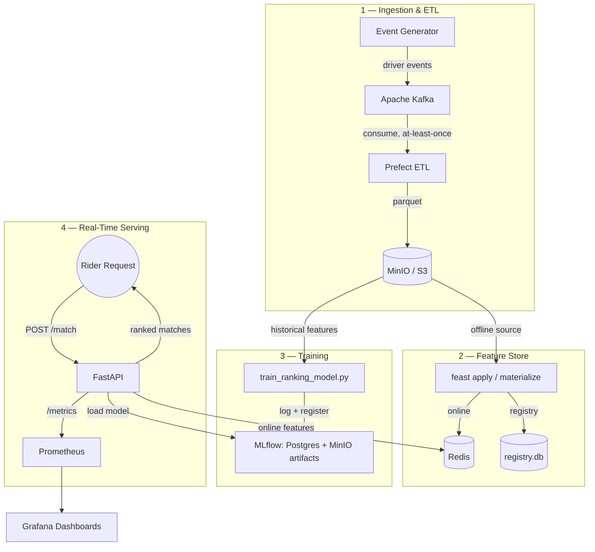

# 🚖 RideMatch: Real-Time Driver Matching System

[](https://www.python.org/)
[](https://fastapi.tiangolo.com/)
[](https://feast.dev/)
[](https://mlflow.org/)
[](https://www.prefect.io/)
[-black?logo=apachekafka)](https://kafka.apache.org/)
[](https://www.docker.com/)

> A real-time ML system that matches riders with drivers: Kafka ingestion →
> Feast feature store → MLflow-tracked model → FastAPI serving, with
> Prometheus/Grafana observability end to end. Every number in this README
> is measured against a live run of the full stack, not estimated — see
> [Measured Performance](#measured-performance).

---

## 🔄 How It Works

Three independent flows share the same feature store, so training and
serving always see the same feature definitions:


```mermaid
flowchart TD
    subgraph Ingestion["1 — Ingestion & ETL"]
        Gen[Event Generator] -->|driver events| Kafka[Apache Kafka]
        Kafka -->|consume, at-least-once| ETL[Prefect ETL]
        ETL -->|parquet| MinIO[(MinIO / S3)]
    end

    subgraph Features["2 — Feature Store"]
        MinIO -->|offline source| Apply[feast apply / materialize]
        Apply -->|online| Redis[(Redis)]
        Apply -->|registry| RegDB[(registry.db)]
    end

    subgraph Training["3 — Training"]
        MinIO -->|historical features| Train[train_ranking_model.py]
        Train -->|log + register| MLflow[MLflow: Postgres + MinIO artifacts]
    end

    subgraph Serving["4 — Real-Time Serving"]
        Rider((Rider Request)) -->|POST /match| API[FastAPI]
        API -->|online features| Redis
        API -->|load model| MLflow
        API -->|ranked matches| Rider
        API -->|/metrics| Prom[Prometheus]
    end

    Prom --> Grafana[Grafana Dashboards]
```

**1. Ingestion & ETL** — `data_sim/generator.py` produces synthetic driver
location/status events onto a Kafka topic (KRaft mode, no Zookeeper).
`prefect/flows/etl_flow.py` consumes in batches, writes Parquet to MinIO, and
only commits Kafka offsets *after* the write succeeds — a crash mid-batch
replays instead of silently dropping events.

**2. Feature Store** — Feast reads the same Parquet files as an offline
source (`type: file`, pointed at an `s3://` path served by MinIO) and
materializes point-in-time-correct feature values into Redis for low-latency
lookup. The feature registry (`registry.db`) is the single source of truth
both training and serving read against, so there's no train/serve schema
drift.

**3. Training** — `train_ranking_model.py` pulls historical features from
Feast, simulates ride requests against them with a **stochastic** acceptance
label (see [Measured Performance](#measured-performance) for why this
matters), trains a `LogisticRegression` pipeline, and logs + registers it
with MLflow (Postgres-backed registry, MinIO-backed artifacts).

**4. Serving** — FastAPI's `/match` endpoint fetches ~100 candidate drivers'
features from Redis via Feast, computes haversine distance to the rider,
scores each candidate with the registered model, and returns the top-k
ranked matches. The endpoint is a **sync** `def`, deliberately — it does
blocking Redis I/O and CPU-bound sklearn inference, and running it as
`async def` would serialize every concurrent request on the event loop
instead of using FastAPI's threadpool.

---

## 🛠️ Tech Stack

| Layer | Technology | Notes |
| :--- | :--- | :--- |
| **Streaming** | Kafka 7.6.1 (KRaft) | `confluentinc/cp-kafka`, no Zookeeper |
| **Orchestration** | Prefect 2.20 | At-least-once ETL semantics |
| **Object storage** | MinIO | S3-compatible; Feast offline store *and* MLflow artifacts |
| **Feature store** | Feast 0.40.1 | Offline: file/S3. Online: Redis |
| **Online store** | Redis 7.2 | Sub-ms feature lookups at serving time |
| **Model registry** | MLflow 2.13.0 | Postgres 16 backend, MinIO artifact store |
| **Training** | scikit-learn 1.5.2, pandas, numpy | `LogisticRegression` ranking pipeline |
| **Serving** | FastAPI 0.128, Uvicorn | Sync endpoint + threadpool for real concurrency |
| **Auth** | Optional `X-API-Key` header | No-op unless `MATCH_API_KEY` is set |
| **Observability** | Prometheus 2.53, Grafana 11.1 | Per-feature histograms, drift gauge, auto-provisioned dashboard |
| **Containerization** | Docker Compose | Every service pinned, healthchecked, `depends_on.condition`-gated |

---

## 📈 Measured Performance

Numbers below are from an actual run against the full containerized stack
(all 9 services, including the `api` container) — reproduce with:
```bash
python scripts/bench_latency.py -n 1000 -c 20
```
which writes `reports/latency.json`.

**Latency** (`/match`, 500 requests, concurrency 20):

| Metric | Value |
| :--- | :--- |
| p50 | 34.9 ms |
| p90 | 107.4 ms |
| p95 | 144.7 ms |
| p99 | 333.1 ms |
| Throughput | 332.6 req/s |
| Errors | 0 / 500 |

**Model** (`python -m src.models.train_ranking_model`):

| Metric | Value |
| :--- | :--- |
| Validation AUC | 0.72 |
| Validation Accuracy | 0.68 |

The label is a stochastic logistic acceptance model (see
`acceptance_probability` in `train_ranking_model.py`), deliberately
non-deterministic so no single feature can perfectly predict it. AUC is
expected to land in a **0.70–0.85 band**; anything above 0.99 trips a
leakage warning rather than being reported as an improvement. An earlier
version of this pipeline had exactly that bug — the nearest driver was
labeled the positive class while `distance_km` was also fed in as a
feature, so the label was a deterministic function of an input and the
model scored ~0.99 AUC while having learned nothing transferable.

---

## ⚡ Quick Start

### Prerequisites
* Docker Desktop (running)
* Python 3.11+
* Git

### Option A — one-shot script (host-run API)
```bash
git clone https://github.com/bhanujjj/Ridematch.git
cd Ridematch
python -m venv .mlflow-venv && source .mlflow-venv/bin/activate
pip install -r requirements.txt

# Wipe any old volumes first if you've run this before with an older
# Kafka/Zookeeper setup -- KRaft won't start on Zookeeper-era volumes.
docker compose -f infra/docker-compose.yml down -v

bash scripts/start_stack.sh   # compose up, generator, ETL, materialize, train, serve
python scripts/bench_latency.py -n 1000 -c 20
```

### Option B — fully containerized (API runs in Docker too)
```bash
cd infra
docker compose up -d --build     # brings up all 9 services, including `api`
docker compose ps                # confirm everything is healthy
curl localhost:8000/ready
```
The `api` container bind-mounts `feature_repo/data/` and `models/`, so
retraining or re-materializing on the host is picked up without a rebuild —
only code changes require `docker compose build api`.

### Try it
```bash
curl -sX POST localhost:8000/match \
  -H 'Content-Type: application/json' \
  -d '{"rider_id":"r1","rider_lat":40.71,"rider_lon":-74.0,"top_k":5}'
```

---

## 🔐 Configuration

Every endpoint/credential is env-driven with a local-development default
(`src/config.py`) — the same code runs on the host (`localhost:9092`) or in
a container (`kafka:29092`) with no edits.

| Variable | Default | Purpose |
| :--- | :--- | :--- |
| `MATCH_API_KEY` | *(unset)* | If set, `/match` requires a matching `X-API-Key` header. `/health` and `/ready` are always open. |
| `REDIS_HOST` / `REDIS_PORT` | `localhost` / `6379` | Feast online store |
| `KAFKA_BOOTSTRAP_SERVERS` | `localhost:9092` | `kafka:29092` inside containers |
| `S3_ENDPOINT_URL` | `http://localhost:9000` | MinIO endpoint for Feast's offline store + MLflow artifacts |
| `MLFLOW_TRACKING_URI` | `http://localhost:5050` | `http://mlflow:5000` inside containers |

---

## 📡 API Reference

| Endpoint | Method | Auth | Purpose |
| :--- | :--- | :--- | :--- |
| `/health` | GET | No | Liveness — always 200 if the process is up |
| `/ready` | GET | No | Readiness — 503 until Feast + model are loaded |
| `/match` | POST | Optional (`X-API-Key`) | Rank candidate drivers for a rider request |
| `/metrics` | GET | No | Prometheus exposition format |

`/ready` names which resource failed (`feature_store` / `model`) in its
response body, and startup is intentionally non-fatal — the process stays
up and debuggable instead of crash-looping.

---

## 🛡️ CI/CD

GitHub Actions (`.github/workflows/ci.yml`) runs on every push/PR:

1. **Lint** — `ruff`, pinned via `ruff.toml` to a stable baseline
   (`E4, E7, E9, F`) rather than ruff's unpinned defaults, which pull in an
   ever-widening set of opinionated rules (blind-except, datetime-tz,
   bandit) that drift between versions and flag intentional patterns —
   this codebase's broad `except Exception` in the API's startup handler is
   a deliberate graceful-degradation design, not an oversight.
2. **Tests** — `pytest tests/test_ci.py` (feast/mlflow mocked, no infra needed).
3. **Model check** — verifies a committed model artifact has
   `predict`/`predict_proba`.
4. **Docker smoke test** — builds the real `Dockerfile`, boots it with
   `SKIP_RESOURCES_INIT=true`, and checks `/metrics` returns 200.

---

## 📊 Monitoring

* **Prometheus** (`:9090`) scrapes `/metrics` from the API — request
  latency histogram, error counter, per-feature value histograms
  (`feature_distance_km`, `feature_accept_rate_7d`, `feature_avg_response_ms`
  — split out because they live on wildly different scales and a shared
  histogram made every accept-rate observation collapse into one bucket),
  and a drift gauge (p95 delta vs. training baseline).
* **Grafana** (`:3000`, `admin`/`admin`) — datasource and dashboard are
  auto-provisioned on `compose up`, no manual click-through required.

---

## ⚠️ Known Limitations

Documented rather than silently left as surprises for the next person:

* **Feast registry is a local file** (`feature_repo/data/registry.db`), not
  Postgres/S3-backed. Fine at this scale; a real multi-instance deployment
  would need a shared registry.
* **Single instance of everything** — one Kafka broker, one Redis, one
  Postgres. No replication, no HA story.
* **No rate limiting** on `/match` beyond what the auth header provides.
* **`offline_store: type: file`** in `feature_store.yaml` reads `s3://`
  paths via PyArrow — works, but reads as contradictory at a glance.

---

## 📂 Project Structure

```text
├── src/
│   ├── config.py       # Central env-driven config (single source of truth)
│   ├── match_api/      # FastAPI app, schemas, auth
│   └── models/         # Training pipeline
├── feature_repo/       # Feast definitions, registry, feature_store.yaml
├── prefect/flows/      # ETL, training, and serving flows
├── data_sim/           # Synthetic driver event generator
├── infra/              # docker-compose.yml, Grafana/Prometheus config
├── scripts/            # start_stack.sh, bench_latency.py, check_model.py
├── tests/              # Unit + CI tests (mocked, no infra required)
├── Dockerfile          # Multi-stage, non-root, healthchecked API image
├── ruff.toml           # Pinned lint baseline
└── HANDOFF.md          # Run/debug notes for whoever picks this up next
```

---

## 📜 License

Distributed under the MIT License. See `LICENSE` for more information.
